# RxJSx Operators

## Usage

The available operators so far are the following:

-  [flatMap / mergeMap](#flatmap--mergeMap)
-  [zipMap](#zipmap)
-  [flatZipMap / mergeZipMap](#flatzipmap--mergezipmap)
-  [projectToFormer](#projecttoformer)
-  [projectToLatter](#projecttolatter)
-  [projectTo](#projectto)
-  [mapFormer](#mapformer)
-  [mapLatter](#maplatter)
-  [flatMapFormer / mergeMapFormer](#flatmapformer--mergemapformer)
-  [flatMapLatter / mergeMapLatter](#flatmaplatter--mergemaplatter)
-  [listMap](#listmap)
-  [flatListMap/ mergeListMap](#flatlistmap--mergelistmap)
-  [listFlatMap](#listflatmap)
-  [flatListFlatMap / mergeListFlatMap](#flatlistflatmap--mergelistflatmap)

### flatMap / mergeMap

An alias of RxJS's `mergeMap`. Just to get rid of the deprecation warning.

### zipMap

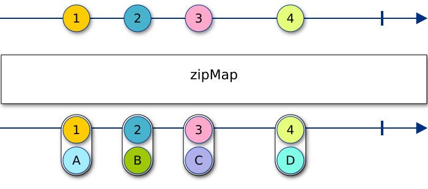

Useful when one wants to transform a value, but also keep the original value to access later:

```typescript
import { of } from 'rxjs';
import { zipMap } from 'rxjs-pipe-ext';

of(1, 2, 3)
  .pipe(zipMap(x => `${x}`))
  .subscribe(([x, s]) => console.log(x, s));
```

Instead of the following code or similar solutions to store the original value of the observable:

```typescript
import { of } from 'rxjs';
import { map, tap } from 'rxjs/operators';

let nummericalVal: number;

of(1, 2, 3)
  .pipe(tap(x => nummericalVal = x))
  .pipe(map(x => `${x}`))
  .subscribe(s => console.log(nummericalVal, s));
```

### flatZipMap / mergeZipMap

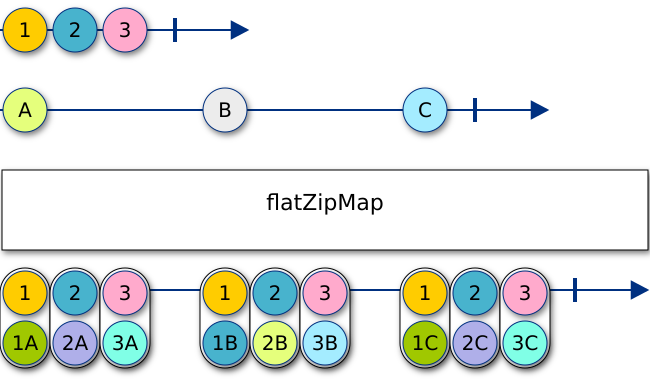

Similar to `flatMap`, it is used when the transformation returns an observable.

```typescript
import { of } from 'rxjs';
import { flatZipMap } from 'rxjs-pipe-ext';

of(1, 2, 3)
  .pipe(flatZipMap(x => of(`${x}`)))
  .subscribe(([x, s]) => console.log(x, s));
```

### projectToFormer

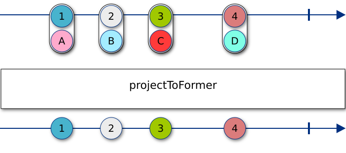

Projects an observable of pairs, i.e. `Observable<[T1, T2]>`, to the first coordinate,
so to get an `Observable<T1>`.

```typescript
import { of } from 'rxjs';
import { projectToFormer } from 'rxjs-pipe-ext';

of<[number, string]>([1, '1'], [2, '2'])
  .pipe(projectToFormer())
  .subscribe((n: number) => console.log(n));
```

### projectToLatter

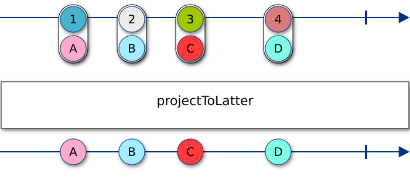

Projects an observable of pairs, i.e. `Observable<[T1, T2]>`, to the second coordinate,
so to get an `Observable<T2>`.

```typescript
import { of } from 'rxjs';
import { projectToLatter } from 'rxjs-pipe-ext';

of<[number, string]>([1, '1'], [2, '2'])
  .pipe(projectToLatter())
  .subscribe((s: string) => console.log(s));
```

### projectTo

Projects an observable of tuples, i.e. `Observable<T[]>`, to a custom coordinate,
so to get an `Observable<T>`.

```typescript
import { of } from 'rxjs';
import { projectTo } from 'rxjs-pipe-ext';

of([1, 2, 3], [4, 5, 6])
  .pipe(projectTo(1)) // of(2, 5)
  .subscribe(console.log);
```

### mapFormer

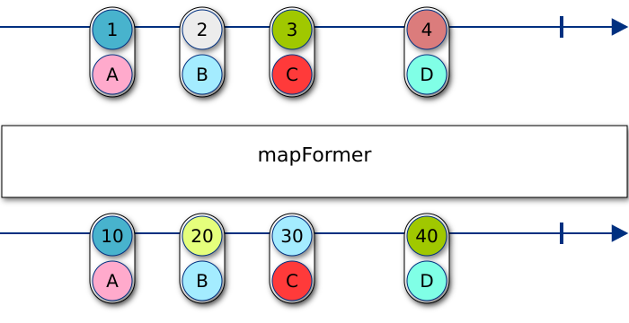

Transforms the first coordinate of an observable of pairs.

```typescript
import { of } from 'rxjs';
import { mapFormer } from 'rxjs-pipe-ext';

of<[number, string]>([1, '1'], [2, '2'])
  .pipe(mapFormer(x => x * 2)) // [2, '1'], [4, '2']
  .subscribe(console.log);
```

### mapLatter


Transforms the second coordinate of an observable of pairs.

```typescript
import { of } from 'rxjs';
import { mapLatter } from 'rxjs-pipe-ext';

of<[number, string]>([1, '1'], [2, '2'])
  .pipe(mapLatter(y => `${y}+${y}`)) // [1, '1+1'], [2, '2+2']
  .subscribe(console.log);
```

### flatMapFormer / mergeMapFormer

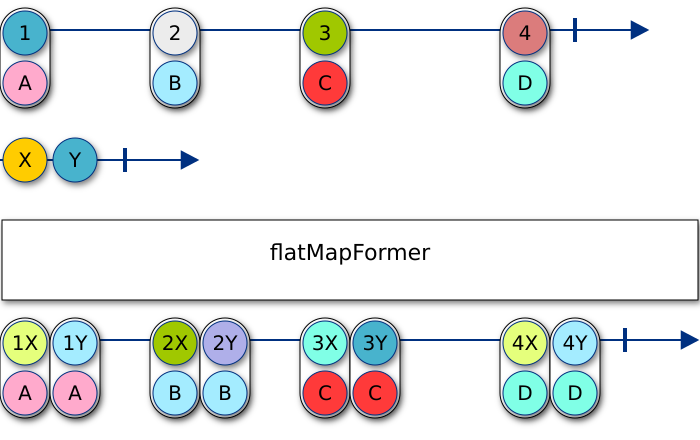

Similar to [`mapFormer`](#mapformer), but works on stream-returning transformations:

```typescript
import { of } from 'rxjs';
import { flatMapFormer } from 'rxjs-pipe-ext';

of<[number, string]>([1, '1'], [2, '2'])
  .pipe(flatMapFormer(x => of(x * 2))) // [2, '1'], [4, '2']
  .subscribe(console.log);
```

### flatMapLatter / mergeMapLatter

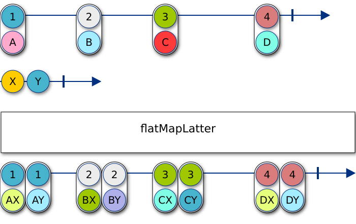

Similar to [`mapLatter`](#maplatter), but works on stream-returning transformations:

```typescript
import { of } from 'rxjs';
import { flatMapLatter } from 'rxjs-pipe-ext';

of<[number, string]>([1, '1'], [2, '2'])
  .pipe(flatMapLatter(y => of(`${y}+${y}`))) // [1, '1+1'], [2, '2+2']
  .subscribe(console.log);
```

### listMap

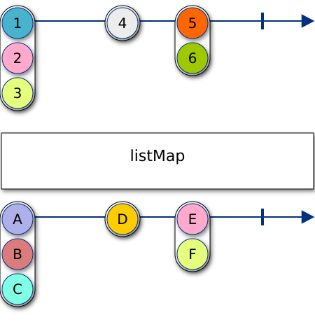

Transforming an observable of list, with a mapping on the list elements:

```typescript
import { of } from 'rxjs';
import { listMap } from 'rxjs-pipe-ext';

of([1, 2, 3])
  .pipe(listMap(x => x * 2))
  .subscribe(console.log); // [2, 4, 6]
```

### flatListMap / mergeListMap

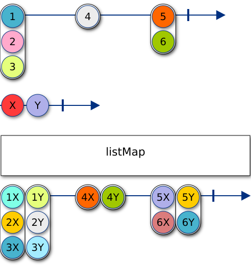

Transforming an observable of list, with a stream-returning member transformation:

```typescript
import { of } from 'rxjs';
import { flatListMap } from 'rxjs-pipe-ext';

of([1, 2, 3])
  .pipe(flatListMap(x => of(x * 2)))
  .subscribe(console.log); // [2, 4, 6]
```

### listFlatMap

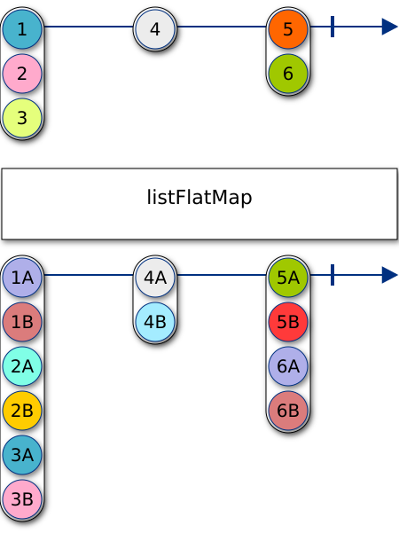

Transforming an observable of list, with a list-returning member transformation:

```typescript
import { of } from 'rxjs';
import { listFlatMap } from 'rxjs-pipe-ext';

of([1, 2, 3])
  .pipe(listFlatMap(x => [x, x * 2]))
  .subscribe(console.log); // [1, 2, 2, 4, 3, 6]
```

### flatListFlatMap / mergeListFlatMap

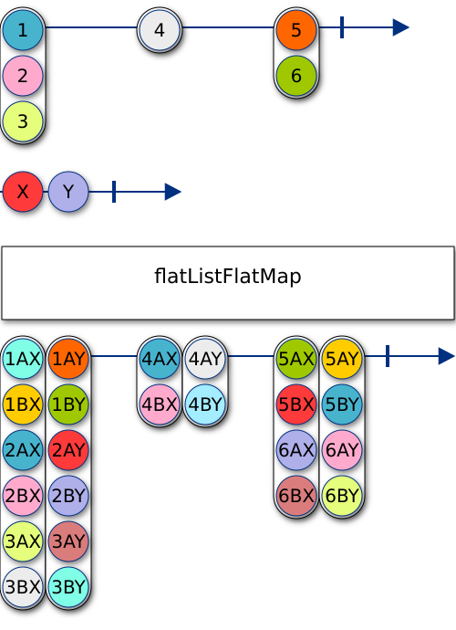

Transforming an observable of list, with a list-observable-returning transformation:

```typescript
import { of } from 'rxjs';
import { flatListFlatMap } from 'rxjs-pipe-ext';

of([1, 2, 3])
  .pipe(flatListFlatMap(x => of([x, x * 2])))
  .subscribe(console.log); // [1, 2, 2, 4, 3, 6]
```
